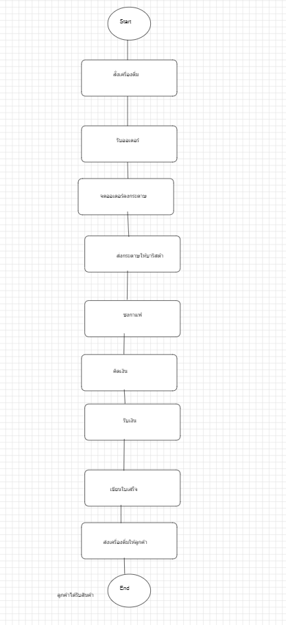
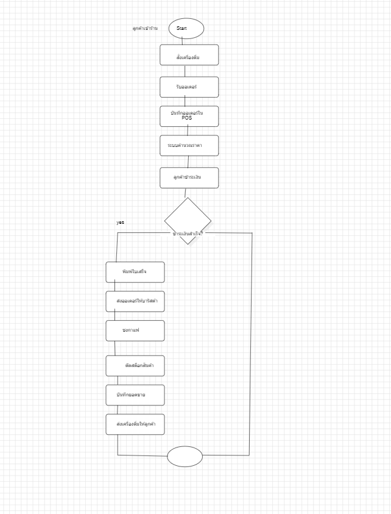

# wk02-feasibility-report.md

# Workshop 02: Feasibility Report & BPMN Diagram

---

# 1. Feasibility Report

## 1.1 ภาพรวมโครงการ

### ชื่อระบบ

Pad-Krapow-cafe-system

### วัตถุประสงค์

พัฒนาระบบเพื่อช่วยในการรับออเดอร์ คิดเงิน ตัดสต็อก และสรุปรายงานยอดขายแบบอัตโนมัติ ลดความผิดพลาดจากการทำงานด้วยมือ และเพิ่มความรวดเร็วในการให้บริการลูกค้า

### ขอบเขตระบบ

- รับออเดอร์จากลูกค้า
- คำนวณราคาอัตโนมัติ
- รับชำระเงิน
- พิมพ์ใบเสร็จ
- ตัดสต็อกสินค้า
- สรุปรายงานยอดขายรายวัน

### ผู้มีส่วนได้ส่วนเสีย (Stakeholders)

- เจ้าของร้าน
- พนักงานแคชเชียร์
- พนักงานชงกาแฟ
- ลูกค้า

---

# 1.2 Technical Feasibility

## เทคโนโลยีที่ใช้

- Node.js
- Express.js
- MySQL
- HTML/CSS/JavaScript
- StarUML สำหรับออกแบบ BPMN

## ความพร้อมของทีม

สมาชิกในทีมมีพื้นฐานการพัฒนาเว็บและฐานข้อมูล สามารถเรียนรู้เครื่องมือเพิ่มเติมได้

## ความเสี่ยงด้านเทคนิค

- การเชื่อมต่อเครื่องพิมพ์ใบเสร็จ
- ปัญหาการเชื่อมต่อฐานข้อมูล
- ระบบอินเทอร์เน็ตขัดข้อง

## ผลการประเมิน

**มีความเป็นไปได้สูง** เพราะใช้เทคโนโลยีที่ได้รับความนิยม มีเอกสารและตัวอย่างจำนวนมาก

---

# 1.3 Economic Feasibility

## ต้นทุนเริ่มต้น (One-time Cost)

| รายการ              | ราคาโดยประมาณ |
| ------------------- | ------------- |
| เครื่องคอมพิวเตอร์  | 18,000 บาท    |
| เครื่องพิมพ์ใบเสร็จ | 5,000 บาท     |
| เครื่องสแกน QR      | 2,000 บาท     |
| ค่าพัฒนาระบบ        | 20,000 บาท    |

**รวมประมาณ 45,000 บาท**

---

## ค่าใช้จ่ายประจำ (Recurring Cost)

- ค่าอินเทอร์เน็ต
- ค่าโฮสต์ฐานข้อมูล
- ค่าบำรุงรักษาระบบ

ประมาณ **1,000 บาท/เดือน**

---

## ผลประโยชน์ที่ได้รับ

- ลดเวลาคิดเงิน
- ลดความผิดพลาดของพนักงาน
- ตัดสต็อกอัตโนมัติ
- ตรวจสอบยอดขายได้แบบ Real-time
- เพิ่มความพึงพอใจของลูกค้า

## ระยะเวลาคืนทุน

ประมาณ **6-8 เดือน**

---

# 1.4 Operational Feasibility

## ผลกระทบต่อผู้ใช้งาน

พนักงานเปลี่ยนจากการจดออเดอร์ด้วยกระดาษมาใช้ระบบ POS

## ความพร้อมขององค์กร

เจ้าของร้านสนับสนุนการนำระบบมาใช้งาน

## การฝึกอบรม

- อบรมพนักงานประมาณ 2 ชั่วโมง
- ทดลองใช้งานก่อนเปิดระบบจริง

## ผลการประเมิน

สามารถนำไปใช้งานได้จริง และผู้ใช้สามารถเรียนรู้ได้ไม่ยาก

---

# 1.5 Schedule Feasibility

| สัปดาห์ | กิจกรรม              |
| ------- | -------------------- |
| 1-2     | วิเคราะห์ความต้องการ |
| 3-4     | ออกแบบระบบ           |
| 5-8     | พัฒนาระบบ            |
| 9-10    | ทดสอบระบบ            |
| 11-12   | แก้ไขและปรับปรุง     |
| 13      | ติดตั้งระบบ          |
| 14      | ฝึกอบรมผู้ใช้งาน     |
| 15-16   | ส่งมอบระบบ           |

## Milestone

- วิเคราะห์ระบบเสร็จ
- ออกแบบฐานข้อมูลเสร็จ
- พัฒนาระบบเสร็จ
- ทดสอบผ่าน
- ส่งมอบระบบ

---

# 1.6 ข้อสรุป

จากการประเมินทั้ง 4 ด้าน พบว่าโครงการมีความเป็นไปได้ในการพัฒนา เนื่องจาก

- ใช้เทคโนโลยีที่ทีมมีความรู้
- ต้นทุนเหมาะสมเมื่อเทียบกับผลประโยชน์
- ผู้ใช้งานสามารถเรียนรู้ระบบได้ง่าย
- สามารถพัฒนาเสร็จภายในระยะเวลาที่กำหนด

ดังนั้น **ควรดำเนินโครงการต่อ**

---

# 2. BPMN Diagram

## BPMN As-Is



## 2.1 As-Is Process (กระบวนการเดิม)

```
(Start)
   |
ลูกค้าเข้าร้าน
   |
สั่งเครื่องดื่ม
   |
พนักงานจดออเดอร์ลงกระดาษ
   |
ส่งกระดาษให้บาริสต้า
   |
บาริสต้าชงกาแฟ
   |
พนักงานคิดเงินด้วยเครื่องคิดเลข
   |
รับเงิน
   |
เขียนใบเสร็จ
   |
ส่งสินค้า
   |
(End)
```

### ปัญหา

- ใช้เวลานาน
- คิดเงินผิดพลาด
- ตัดสต็อกไม่ได้
- ไม่มีรายงานยอดขาย

---

## BPMN To-Be



## 2.2 To-Be Process (หลังมีระบบ POS)

```
(Start)
   |
ลูกค้าเข้าร้าน
   |
สั่งเครื่องดื่ม
   |
พนักงานบันทึกออเดอร์ใน POS
   |
ระบบคำนวณราคาอัตโนมัติ
   |
รับชำระเงิน
   |
ระบบพิมพ์ใบเสร็จ
   |
ระบบส่งออเดอร์ไปยังบาริสต้า
   |
บาริสต้าชงกาแฟ
   |
ระบบตัดสต็อกอัตโนมัติ
   |
ส่งสินค้าให้ลูกค้า
   |
บันทึกยอดขาย
   |
(End)
```

---

# 3. การเปรียบเทียบ As-Is และ To-Be

| As-Is               | To-Be                       |
| ------------------- | --------------------------- |
| จดออเดอร์ด้วยกระดาษ | บันทึกผ่าน POS              |
| คิดเงินด้วยมือ      | คำนวณอัตโนมัติ              |
| เขียนใบเสร็จ        | พิมพ์ใบเสร็จ                |
| ไม่ตัดสต็อก         | ตัดสต็อกอัตโนมัติ           |
| ไม่มีรายงาน         | มีรายงานยอดขายแบบ Real-time |

---

# 4. ผลของ BPMN To-Be ต่อ Feasibility

### Operational Feasibility

- ลดขั้นตอนการทำงานของพนักงาน
- ลดความผิดพลาดในการรับออเดอร์
- ใช้งานง่าย
- เพิ่มความรวดเร็วในการให้บริการ

### Economic Feasibility

- ลดต้นทุนจากการใช้กระดาษ
- ลดเวลาการคิดเงิน
- เพิ่มประสิทธิภาพการทำงาน
- เจ้าของร้านสามารถตรวจสอบยอดขายได้ทันที
- ช่วยให้คืนทุนได้เร็วขึ้น
