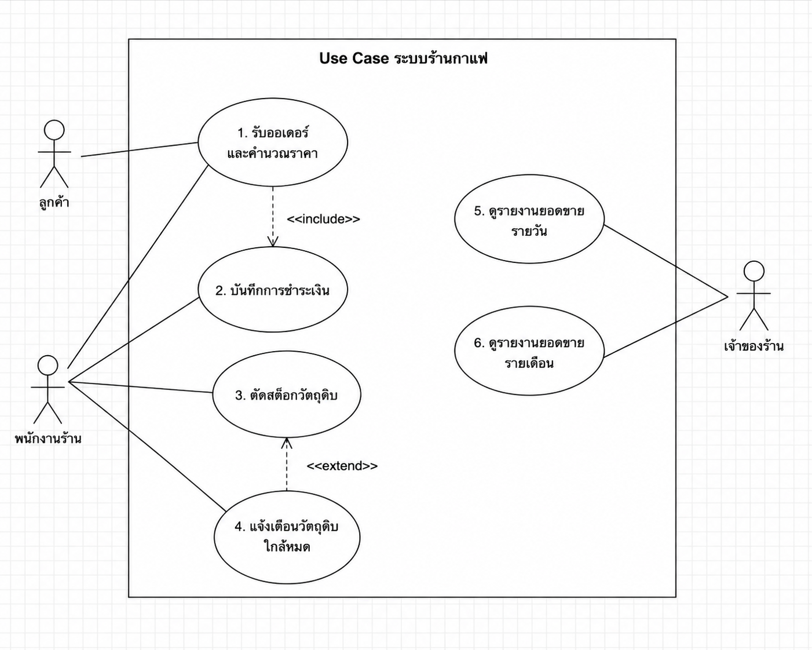

# wk04 - User Stories และ Use Case

## ระบบ: Pad-Krapow-cafe-system

---

# 1. Actors

จากการวิเคราะห์ Requirements Document v1 สามารถระบุ Actor หลักของระบบได้ 3 Actor ดังนี้

### 1.1 ลูกค้า (Customer)

หน้าที่หลัก:

* สั่งซื้อเมนูอาหารหรือเครื่องดื่ม
* ระบุจำนวนรายการที่ต้องการ
* ชำระเงินตามช่องทางที่ร้านรองรับ
* รับบริการและตรวจสอบความถูกต้องของรายการสั่งซื้อ

### 1.2 พนักงานบาริสต้า (Barista)

หน้าที่หลัก:

* รับออเดอร์จากลูกค้า
* บันทึกรายการสั่งซื้อเข้าสู่ระบบ
* คำนวณราคาและแจ้งยอดเงิน
* บันทึกช่องทางการชำระเงิน
* ตรวจสอบการแจ้งเตือนเกี่ยวกับวัตถุดิบ

### 1.3 เจ้าของร้าน (Owner)

หน้าที่หลัก:

* ตรวจสอบยอดขายรายวัน
* ตรวจสอบยอดขายรายเดือน
* ตรวจสอบข้อมูลสต็อกวัตถุดิบ
* ใช้ข้อมูลจากระบบในการติดตามการดำเนินงานของร้าน

---

# 2. Use Case Diagram

## 2.1 รายการ Use Case

ระบบประกอบด้วย Use Case หลักดังต่อไปนี้

1. รับออเดอร์และคำนวณราคา
2. บันทึกช่องทางการชำระเงิน
3. ยืนยันการขาย
4. ตัดสต็อกวัตถุดิบ
5. แจ้งเตือนวัตถุดิบใกล้หมด
6. ดูยอดขายรายวัน
7. ดูยอดขายรายเดือน
8. ตรวจสอบสต็อกวัตถุดิบ

## 2.2 ความสัมพันธ์ระหว่าง Use Case

* **รับออเดอร์และคำนวณราคา** `<<include>>` **บันทึกช่องทางการชำระเงิน**
* **ยืนยันการขาย** `<<include>>` **ตัดสต็อกวัตถุดิบ**
* **แจ้งเตือนวัตถุดิบใกล้หมด** `<<extend>>` **ตัดสต็อกวัตถุดิบ**

## 2.3 แนวทางวาด Use Case Diagram ใน StarUML

---

# 3. Use Case Description

## Use Case: รับออเดอร์และคำนวณราคา

| หัวข้อ          | รายละเอียด                                               |
| --------------- | -------------------------------------------------------- |
| Use Case ID     | UC-01                                                    |
| Use Case Name   | รับออเดอร์และคำนวณราคา                                   |
| Primary Actor   | พนักงานบาริสต้า                                          |
| Secondary Actor | ลูกค้า                                                   |
| Goal            | บันทึกรายการสั่งซื้อและคำนวณยอดเงินรวมของออเดอร์         |
| Trigger         | ลูกค้าต้องการสั่งซื้อสินค้า                              |
| Pre-condition   | พนักงานสามารถเข้าใช้งานระบบได้ และระบบมีข้อมูลเมนูสินค้า |
| Post-condition  | ระบบบันทึกออเดอร์และแสดงยอดเงินรวม                       |

## Main Flow

1. ลูกค้าแจ้งรายการเมนูที่ต้องการสั่ง
2. พนักงานบาริสต้าเลือกเมนูจากระบบ
3. พนักงานระบุจำนวนของแต่ละเมนู
4. ระบบแสดงรายการที่เลือกในออเดอร์
5. ระบบคำนวณราคาของแต่ละรายการ
6. ระบบคำนวณยอดเงินรวมของออเดอร์โดยอัตโนมัติ
7. ระบบแสดงยอดเงินรวมให้พนักงานตรวจสอบ
8. พนักงานยืนยันรายการออเดอร์
9. ระบบบันทึกข้อมูลออเดอร์
10. Use Case ดำเนินการต่อไปยัง **บันทึกช่องทางการชำระเงิน**

## Alternative Flow

### A1: ลูกค้าต้องการเพิ่มรายการ

1. หลังจากระบบแสดงรายการออเดอร์ ลูกค้าต้องการเพิ่มเมนู
2. พนักงานเลือกเมนูเพิ่มเติม
3. ระบบเพิ่มรายการเข้าสู่ออเดอร์
4. ระบบคำนวณยอดเงินรวมใหม่
5. กลับไปดำเนินการใน Main Flow ข้อ 7

### A2: ลูกค้าต้องการเปลี่ยนจำนวนสินค้า

1. พนักงานเลือกแก้ไขจำนวนสินค้า
2. พนักงานระบุจำนวนใหม่
3. ระบบอัปเดตรายการสินค้า
4. ระบบคำนวณยอดเงินรวมใหม่
5. กลับไปดำเนินการใน Main Flow ข้อ 7

## Exception Flow

### E1: ไม่สามารถบันทึกออเดอร์ได้

1. พนักงานยืนยันการบันทึกออเดอร์
2. ระบบไม่สามารถบันทึกข้อมูลได้
3. ระบบแสดงข้อความแจ้งเตือนว่าไม่สามารถบันทึกออเดอร์ได้
4. ระบบต้องไม่ยืนยันออเดอร์ดังกล่าว
5. พนักงานสามารถตรวจสอบข้อมูลและลองบันทึกใหม่อีกครั้ง

---

# 4. User Stories

## US-01: บันทึกรายการสั่งซื้อ

**As a** พนักงานบาริสต้า
**I want** บันทึกรายการเมนูและจำนวนสินค้าของลูกค้า
**So that** สามารถสร้างออเดอร์ได้อย่างถูกต้อง

### Acceptance Criteria

**AC-01**

* Given พนักงานอยู่ในหน้ารับออเดอร์
* When พนักงานเลือกเมนูและระบุจำนวนสินค้า
* Then ระบบต้องเพิ่มรายการลงในออเดอร์

**AC-02**

* Given มีรายการสินค้าอยู่ในออเดอร์
* When พนักงานเพิ่มเมนูรายการใหม่
* Then ระบบต้องแสดงรายการทั้งหมดในออเดอร์

---

## US-02: คำนวณยอดเงินรวม

**As a** พนักงานบาริสต้า
**I want** ให้ระบบคำนวณยอดเงินรวมของออเดอร์โดยอัตโนมัติ
**So that** สามารถแจ้งราคาที่ถูกต้องแก่ลูกค้าได้

### Acceptance Criteria

**AC-01**

* Given มีรายการสินค้าอยู่ในออเดอร์
* When ระบบบันทึกรายการสินค้า
* Then ระบบต้องคำนวณยอดเงินรวมโดยอัตโนมัติ

**AC-02**

* Given ระบบแสดงยอดเงินรวมของออเดอร์
* When พนักงานเปลี่ยนจำนวนสินค้า
* Then ระบบต้องคำนวณยอดเงินรวมใหม่

---

## US-03: เพิ่มหรือแก้ไขรายการออเดอร์

**As a** พนักงานบาริสต้า
**I want** เพิ่มรายการหรือแก้ไขจำนวนสินค้าในออเดอร์
**So that** ออเดอร์ตรงตามความต้องการของลูกค้า

### Acceptance Criteria

**AC-01**

* Given ระบบมีออเดอร์ที่กำลังดำเนินการ
* When พนักงานเพิ่มเมนูใหม่
* Then ระบบต้องเพิ่มเมนูใหม่เข้าสู่ออเดอร์

**AC-02**

* Given ระบบมีรายการสินค้าอยู่ในออเดอร์
* When พนักงานแก้ไขจำนวนสินค้า
* Then ระบบต้องอัปเดตจำนวนและคำนวณราคาใหม่

---

## US-04: บันทึกช่องทางการชำระเงิน

**As a** พนักงานบาริสต้า
**I want** เลือกและบันทึกช่องทางการชำระเงินของลูกค้า
**So that** ระบบสามารถเก็บข้อมูลการชำระเงินของแต่ละออเดอร์ได้

### Acceptance Criteria

**AC-01**

* Given พนักงานมีออเดอร์ที่ต้องชำระเงิน
* When พนักงานเลือกช่องทางการชำระเงิน
* Then ระบบต้องรองรับเงินสด โอนเงิน และ QR พร้อมเพย์

**AC-02**

* Given พนักงานเลือกช่องทางการชำระเงินแล้ว
* When พนักงานยืนยันการชำระเงิน
* Then ระบบต้องบันทึกช่องทางการชำระเงินพร้อมกับออเดอร์

---

## US-05: ยืนยันการขายและตัดสต็อก

**As a** พนักงานบาริสต้า
**I want** ให้ระบบตัดจำนวนวัตถุดิบหลังจากยืนยันการขาย
**So that** ข้อมูลสต็อกมีความถูกต้อง

### Acceptance Criteria

**AC-01**

* Given มีออเดอร์ที่บันทึกสำเร็จ
* When พนักงานยืนยันการขาย
* Then ระบบต้องตัดจำนวนวัตถุดิบที่เกี่ยวข้องโดยอัตโนมัติ

**AC-02**

* Given มีการตัดสต็อกวัตถุดิบ
* When จำนวนวัตถุดิบลดลง
* Then ระบบต้องอัปเดตจำนวนสต็อกคงเหลือ

---

## US-06: แจ้งเตือนวัตถุดิบใกล้หมด

**As a** พนักงานบาริสต้า
**I want** ได้รับการแจ้งเตือนเมื่อวัตถุดิบเหลือน้อย
**So that** สามารถเตรียมสั่งวัตถุดิบเพิ่มเติมได้ทันเวลา

### Acceptance Criteria

**AC-01**

* Given ระบบมีการกำหนดจำนวนขั้นต่ำของวัตถุดิบ
* When จำนวนวัตถุดิบลดลงต่ำกว่าค่าที่กำหนด
* Then ระบบต้องแสดงการแจ้งเตือน

**AC-02**

* Given พนักงานอยู่ในระบบ
* When วัตถุดิบมีจำนวนต่ำกว่าค่าขั้นต่ำ
* Then พนักงานต้องสามารถเห็นข้อมูลวัตถุดิบที่ต้องดำเนินการ

---

## US-07: ดูยอดขายรายวัน

**As a** เจ้าของร้าน
**I want** ดูข้อมูลยอดขายรายวันแยกตามเมนู
**So that** สามารถตรวจสอบผลการขายของร้านในแต่ละวันได้

### Acceptance Criteria

**AC-01**

* Given เจ้าของร้านอยู่ในหน้ารายงาน
* When เลือกดูยอดขายรายวัน
* Then ระบบต้องแสดงยอดขายแยกตามชื่อเมนู

**AC-02**

* Given มีข้อมูลการขายในวันนั้น
* When ระบบสร้างรายงาน
* Then ระบบต้องแสดงจำนวนที่ขายได้ของแต่ละเมนู

---

## US-08: ดูยอดขายรายเดือน

**As a** เจ้าของร้าน
**I want** ดูข้อมูลยอดขายรายเดือน
**So that** สามารถวิเคราะห์ยอดขายและเมนูที่ขายดีที่สุดได้

### Acceptance Criteria

**AC-01**

* Given เจ้าของร้านเลือกเดือนที่ต้องการ
* When ระบบสร้างรายงานรายเดือน
* Then ระบบต้องแสดงยอดขายรวมของเดือนนั้น

**AC-02**

* Given มีข้อมูลยอดขายของเดือนนั้น
* When ระบบสรุปรายงาน
* Then ระบบต้องแสดงเมนูขายดี 5 อันดับแรก

---

# 5. การตรวจสอบ User Stories ตามหลัก INVEST

| User Story | I | N | V | E | S | T | ผลการตรวจสอบ |
| ---------- | - | - | - | - | - | - | ------------ |
| US-01      | ✓ | ✓ | ✓ | ✓ | ✓ | ✓ | ผ่าน         |
| US-02      | ✓ | ✓ | ✓ | ✓ | ✓ | ✓ | ผ่าน         |
| US-03      | ✓ | ✓ | ✓ | ✓ | ✓ | ✓ | ผ่าน         |
| US-04      | ✓ | ✓ | ✓ | ✓ | ✓ | ✓ | ผ่าน         |
| US-05      | ✓ | ✓ | ✓ | ✓ | ✓ | ✓ | ผ่าน         |
| US-06      | ✓ | ✓ | ✓ | ✓ | ✓ | ✓ | ผ่าน         |
| US-07      | ✓ | ✓ | ✓ | ✓ | ✓ | ✓ | ผ่าน         |
| US-08      | ✓ | ✓ | ✓ | ✓ | ✓ | ✓ | ผ่าน         |

### ความหมายของ INVEST

* **I – Independent:** User Story สามารถพัฒนาแยกจากเรื่องอื่นได้ในระดับหนึ่ง
* **N – Negotiable:** สามารถปรับรายละเอียดร่วมกันระหว่างทีมพัฒนาและผู้เกี่ยวข้องได้
* **V – Valuable:** สร้างคุณค่าให้แก่ผู้ใช้งานหรือธุรกิจ
* **E – Estimable:** ทีมสามารถประเมินเวลาและความซับซ้อนในการพัฒนาได้
* **S – Small:** มีขนาดเหมาะสมต่อการพัฒนา
* **T – Testable:** สามารถทดสอบได้จาก Acceptance Criteria

---

# 6. Traceability ระหว่าง Requirements และ User Stories

| Functional Requirement         | User Story ที่เกี่ยวข้อง |
| ------------------------------ | ------------------------ |
| FR-01 บันทึกรายการสั่งซื้อ     | US-01, US-03             |
| FR-02 คำนวณยอดเงินรวม          | US-02                    |
| FR-03 บันทึกช่องทางการชำระเงิน | US-04                    |
| FR-04 ตัดสต็อกวัตถุดิบ         | US-05                    |
| FR-05 แจ้งเตือนวัตถุดิบใกล้หมด | US-06                    |
| FR-06 สรุปยอดขายรายวัน         | US-07                    |
| FR-07 สรุปยอดขายรายเดือน       | US-08                    |

---

# 7. สรุป

เอกสารฉบับนี้แปลง Functional Requirements จาก Requirements Document v1 เป็น Use Case Diagram, Use Case Description และ User Stories เพื่อใช้เป็นแนวทางในการพัฒนาระบบ Pad-Krapow-cafe-system ในขั้นตอนถัดไป โดย User Stories มี Acceptance Criteria ที่สามารถนำไปใช้ในการทดสอบระบบได้
